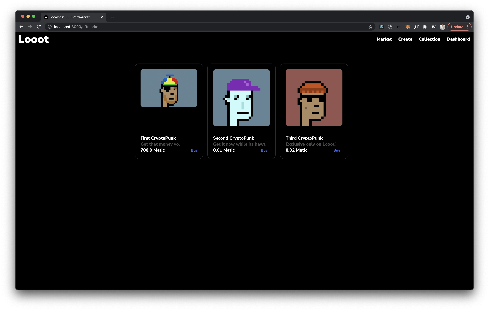
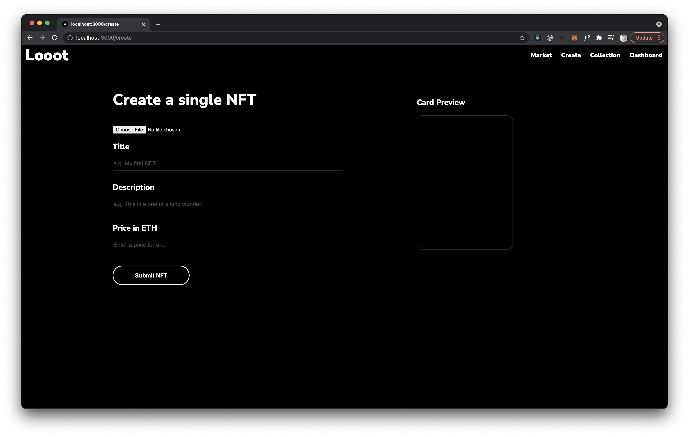

# Looot (Nft Marketplace)

A simple attempt at building an NFT marketplace - inspired by Rarible.\
Demo site deployment is a WIP!




## Quick start

I recommend using [Hardhat](https://hardhat.org/) for development and running an instance.\
After running the `deploy.js` script below, you will need to copy the `NFT` and `NFTMarket` contract addresses into the `.secret` file before running `npm run dev`.

```
npm install
cp .secretexample .secret
npx hardhat node //in new terminal window
npx hardhat run scripts/deploy.js --network localhost //in another terminal window
npm run dev
```

## Technologies used

[NEXT.js](https://nextjs.org/)\
[Axios](https://axios-http.com/docs/intro)\
[Chai.js](https://www.chaijs.com/)\
[Ethereum Waffle](https://ethereum-waffle.readthedocs.io/en/latest/)\
[Ethers.js](https://docs.ethers.io/v5/)\
[Hardhat](https://hardhat.org/)\
[IPFS HTTP Client](https://www.npmjs.com/package/ipfs-http-client)\
[OpenZeppelin](https://openzeppelin.com/)\
[Styled-Components](https://styled-components.com/)\
[Web3Modal](https://github.com/Web3Modal/web3modal)
